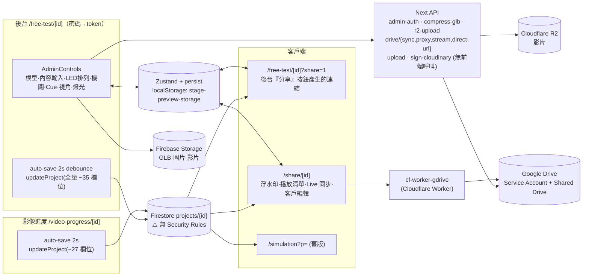

# StagePV 技術戰略總圖（main 版）

> 盤點基準：`main` @ `0f1bc2a`（2026-07-22）｜盤點日：2026-09-24
> 定位：**技術面**的地圖，與商業面的 [`stagepv-strategy-2026.md`](../stagepv-strategy-2026.md) 互補；給 AI 的開發慣例仍以 [`CLAUDE.md`](../CLAUDE.md) 為準。
> 規模：src 約 20,900 行、87 個 TS/TSX 檔；`useStore.ts` 1,400 行；main 共 164 個 commit。

---

## 0. 先講結論

1. **程式本身健康**：`tsc` ✅、`next build` ✅，功能完整度高（機關、LED 排列、Cue、直播上牆、客戶編輯、Live 同步）。
2. **最大風險不在功能，而在「資料邊界」**：API 沒驗證（R2 可被任意刪檔、Drive 可被任意下載），Firestore 沒有規則，還有**跨專案資料污染**的結構性漏洞（見 §4 P0-3）。
3. **文件和 repo 有落差**：GitHub 預設分支仍是 8 個月前的 `master`；`ARCHITECTURE.md`、`AI_CONTEXT.md` 已過時；`CLAUDE.md` 寫說 FFmpeg/Cloudinary 仍在使用，但實際上已經沒有接線。
4. **第 3 點「鎖定預設內容」已依 §5 實作。**

---

## 1. 系統架構

### 路由一覽
| 路由 | 角色 | 寫入 Firestore? | 備註 |
|---|---|---|---|
| `/` | 首頁 + 後台密碼 | — | 密碼送 `/api/admin-auth` |
| `/free-test` | 專案列表 | 建立/刪除 | |
| `/free-test/[id]` | **主後台** | ✅ auto-save 全量 | |
| `/free-test/[id]?share=1` | **目前後台「分享」按鈕給客戶的連結** | ❌ | 免密碼；載入 `contentTextures` + `activeContentId` |
| `/share/[id]` | 新版客戶分享頁 | 僅客戶編輯的白名單欄位 | 有 R2/GDrive 影片時會**覆寫**內容清單為第一支影片 |
| `/video-progress/[id]` | 影像進度 | ✅ auto-save（欄位較少） | 與 `/free-test/[id]` 同時開啟會互相覆寫 |
| `/simulation?p=` | 舊版分享 | ❌ | 可淘汰候選 |

---

## 2. 健康檢查（本次在 main 實測）

| 檢查 | 結果 |
|---|---|
| `npm ci` | ✅ |
| `tsc --noEmit` | ✅ 0 錯誤 |
| `next build` | ✅（1 個 edge runtime 提示，屬正常） |
| `eslint src` | ❌ 121 errors / 121 warnings：95 個 `no-explicit-any`、100 個未使用變數 |
| 自動化測試 / CI | ❌ 都沒有 |
| 機密外洩掃描 | ✅ repo 與歷史中沒有 `.env`、私鑰或 API key（只有 `.env.example` 的佔位字串） |
| GitHub 預設分支 | ⚠️ 仍是 `master`（2026-01，檢查紅燈），實際開發在 `main` |

---

## 3. 模組狀態（main）

### 仍在用、但有已知債（沿用 CLAUDE.md §8，不重複）
stageObjects 全量訂閱、AdminControls 569 行單體、GLB node transform 被丟棄、Z 軸反轉，詳見 CLAUDE.md §6。

### 已沒有任何地方引用（死碼候選，**需你確認才刪**）
| 項目 | 說明 |
|---|---|
| `components/canvas/CameraTransition.tsx` | 已由 SceneGraph 內建動畫取代；刪掉後 `maath` 套件也沒人用 |
| `components/client/CueSelector.tsx` | 沒有任何地方 import |
| `components/client/PerfectRenderToggle.tsx` | 沒有任何地方 import |
| `components/client/TranscodeModal.tsx` + `lib/transcode.ts` + `@ffmpeg/*` | **FFmpeg 沒有接線**，錄影直接下載；CLAUDE.md §2/§6 的描述已過時 |
| `components/debug/R2VideoDebugPanel.tsx` | 除錯面板，沒有掛載 |
| `hooks/useHlsTexture.ts` | 由 VideoManager 取代 |
| `api/upload`、`api/sign-cloudinary` + `cloudinary` 套件 | 前端沒有任何呼叫（舊專案既有的 Cloudinary URL 仍可播放，與這兩支 API 無關） |
| `gltf-pipeline`、`meshoptimizer` 套件 | 從未被 import；`gltf-pipeline` 還會帶進很大的 `cesium` |
| COOP/COEP 標頭（`next.config.ts`） | 只為了 FFmpeg 的 SharedArrayBuffer 而加；若 FFmpeg 移除，可一併拿掉並解除 CLAUDE.md 地雷 #6 的限制 |

`ContentInspector.tsx` 是**刻意隱藏**的 stub（註解說明待開發），保留不動。

### Repo 衛生
- 根目錄有 **52 個已套用的 `.patch` 檔**（都已經在 git 歷史裡），建議移到 `patches/applied/` 或刪除。
- `ARCHITECTURE.md` 描述了不存在的 `Stage.tsx`、`VideoScreen.tsx`、`/admin` 路由；`AI_CONTEXT.md` 是 2026-04 自動產生的快照，而且是 Windows 本機狀態。建議以 CLAUDE.md 為唯一真相來源，另外兩份標註過時或刪除，避免 AI 讀到錯誤架構。

---

## 4. 風險清單（依優先級）

### 🔴 P0：安全與資料完整性

| # | 問題 | 位置 | 影響 | 建議 |
|---|---|---|---|---|
| P0-1 | **`DELETE /api/r2-upload` 沒有驗證，可刪除任意 key** | `api/r2-upload/route.ts:108` | 任何人都能清空 R2 上的客戶影片 | 驗證 admin token；限制 key 前綴 |
| P0-2 | **`/api/drive/proxy`、`/api/drive/stream/[fileId]` 沒有驗證**，接受任意 fileId | `api/drive/*` | Service Account 能存取的**所有** Drive 檔案（含 Shared Drive）都可以被下載 | 只允許專案登記過的 `driveFileId`，或驗證 token |
| P0-3 | **跨專案資料污染**：persist 會保留上一個專案的 `cues/r2Videos/gdriveVideos/videoFolders/floorPlanTextureUrl…`；載入新專案時「欄位不存在就不覆蓋」（`...(data.cues ? …)`）；接著 auto-save 把殘留值寫進新專案。`createProject` 只初始化 5 個欄位，所以**新專案必中** | `free-test/[id]/page.tsx:215`、`video-progress/[id]/page.tsx:192`、`useStore.ts` partialize | A 專案的 cue/影片清單可能出現在 B 專案（含客戶機密內容） | 載入前先重設為預設值（`useStore.setState(initialProjectState)`），缺欄位時給空值而不是保留舊值 |
| P0-4 | **兩個頁面同時 auto-save 全量欄位**（`/free-test/[id]` 與 `/video-progress/[id]`） | 兩頁的 auto-save effect | 兩個分頁同時開著會 last-write-wins，互相覆蓋 | 各頁只寫自己負責的欄位，或加版本號 |
| P0-5 | Firestore 無 Security Rules、admin `'0903'` fallback | 已列於 CLAUDE.md §3/§8 | — | 沿用既有計畫（依 CLAUDE.md 慣例，**不擅自重構驗證機制**） |
| P0-6 | 後台登入只在前端檢查 `token.length === 32`；`AUTH_SECRET` 有預設值 | `free-test/[id]/page.tsx:197` | 在 sessionStorage 塞任意 32 字元就能進後台 UI | 載入時呼叫已存在的 `GET /api/admin-auth?token=` 驗證（目前沒有人用它） |

### 🟠 P1：正確性
- `/share/[id]` 的內容優先序固定為「`?video` → 第一支 R2/GDrive 影片 → `activeContentId`」，**後台無法指定預設內容**（第 3 點的需求來源）。
- `ratelimit.ts` 是記憶體版本，在 Vercel serverless 多實例下實際上無效（檔頭已自註）。
- `/free-test/[id]?share=1` 的 `ClientUploader` 會清空整個 `contentTextures`（只影響客戶本機，不會寫回雲端）。

### 🟡 P2：工程體質
- lint 歸零（先修真正的 hooks 錯誤，`any` 可以分批處理）→ 加 CI（lint + tsc + build）。
- GitHub 預設分支改為 `main`，並封存 `master`。
- 死碼與套件清理（§3，需確認）。
- 整理文件：CLAUDE.md 修正 FFmpeg/Cloudinary 描述；補上 `/free-test/[id]?share=1` 是實際的分享連結。

---

## 5. 第 3 點的地基：內容顯示的完整資料流

「現在顯示哪個內容」由單一欄位 `activeContentId` 決定，**寫入者很多**：

| 寫入者 | 時機 |
|---|---|
| `TextureUploader`（後台「內容輸入」） | 點縮圖 |
| `store.addContentTexture` | 第一次上傳時自動選取 |
| `GDriveVideoManager`、`R2VideoManager` | 點影片 |
| `ClientPlaylistSidebar`、`lib/client-playback.ts` | 客戶點播放清單 |
| `ClientUploader` | 客戶上傳本地檔案 |
| `LiveSync` | Live 同步跟隨主控端 |
| `/free-test/[id]` auto-save | **把後台最後點的內容寫回 Firestore**，這就是「預設跑掉」的根因 |
| `/video-progress/[id]` auto-save | 同上 |

**讀取端**（分享時決定客戶先看到什麼）：
- `/free-test/[id]?share=1`：直接用 Firestore 的 `activeContentId`，也就是後台最後點的那個。
- `/share/[id]`：`?video` → 第一支 R2/GDrive 影片 → `activeContentId`。

### 已實作：鎖定預設內容（`defaultContentId`）
依你的決定：①只鎖「內容輸入」上傳的圖片和影片；②鎖定後後台照常可以預覽其他內容，只是不改變預設；③新增獨立的預設內容欄位，`/share/[id]` 也套用。
- 新欄位 `defaultContentId`，**不去改動 `activeContentId` 的行為**。後台點其他內容照常預覽；auto-save 仍然會寫 `activeContentId`，但分享頁優先讀 `defaultContentId`。
- `/free-test/[id]?share=1`：預設內容仍存在於清單中時，優先顯示它。
- `/share/[id]` 優先序：`?video=`（明確指定）→ **`defaultContentId`** → 第一支 R2/GDrive 影片 → `activeContentId`。套用預設內容時，不會觸發第一支影片綁定的 cue。
- 同步路徑（CLAUDE.md 規則）：`ProjectState`、`/free-test/[id]` 存檔與載入、`/share/[id]` 載入都已加上；刻意**不進 persist**，載入時一律 `?? null` 重設，避免 P0-3 的污染。
- 鎖定中的內容不能刪除（刪除鈕隱藏，長按也會被擋）。
- 不受影響：`?playlist=gdrive` 播放清單模式（會自動播放 Drive 第一支影片）、Live 同步跟隨、客戶本機上傳。這些都是客戶端明確的操作。

---

## 6. 建議執行順序

| 順序 | 內容 | 風險 |
|---|---|---|
| ✅ 1 | 分支改以 main 為基礎（已完成） | — |
| ✅ 2 | 本文件（技術盤點） | — |
| ✅ 3 | 鎖定預設內容（§5） | 低-中 |
| 4 | P0-1/P0-2 API 驗證（小改動、高價值） | 低 |
| 5 | P0-3/P0-4 專案載入重設 + 分頁寫入範圍 | 中 |
| 6 | 死碼/套件清理（§3，逐項確認） | 低 |
| 7 | lint 歸零 + CI；預設分支改 main | 低 |
| 8 | Firestore Rules（依 stagepv-strategy-2026 排程） | 中 |
